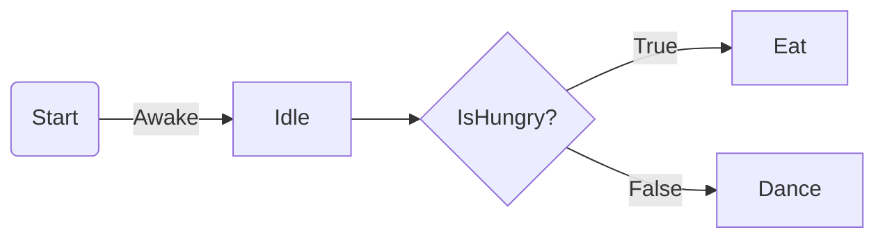
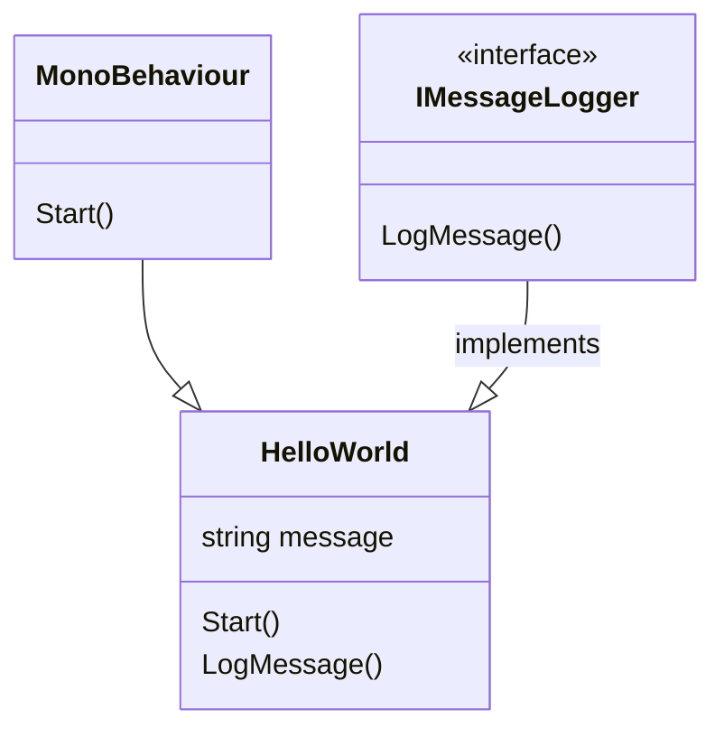
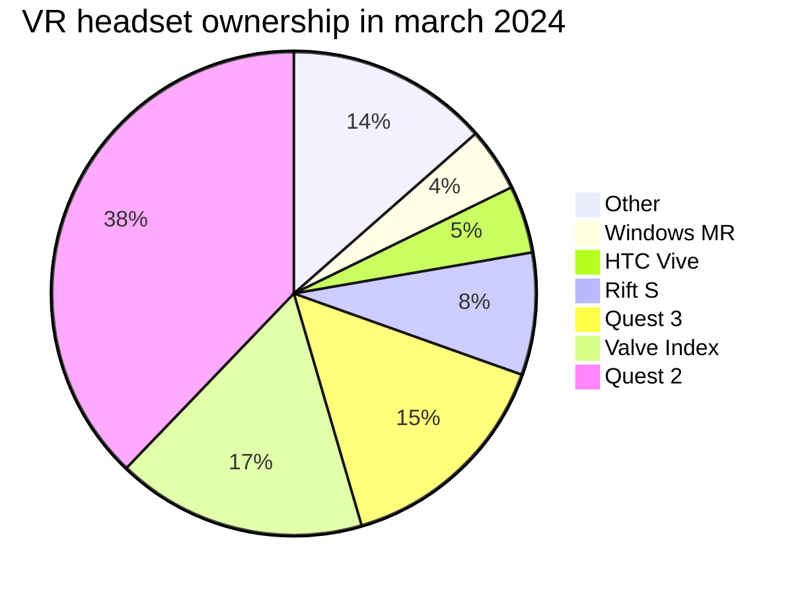



# Introduction

Welcome to the documentation for your `online thesis`!
My name is `Jeff Jacobs`, game design professor at Luca School of Arts.
I created this template for our students to create their own online thesis.

We started to feel that pure text documents got a bit outdated, especially for our medium of `Game Design`.
Students want to show off their work using video and audio, maybe even a playable WebGL build right here in their thesis!
Let's walk through all of the features this template offers you.

This resource is divided into two primary chapters [Template Features](#TemplateFeatures) and [Content Features](#ContentFeatures).


# Template Features {#TemplateFeatures}


## Automatic TOC

<div id="thesis-toc"></div>

The template automatically generates a Table Of Contents for you.
When you look at the site on a large display it will be shown off to the left side.
All of the chapters are clickable and will take you to their respective chapter in the text.
Once you scroll into a chapter it's sub-chapters will show up.

You can easily write chapters in the following way :

```markdown
# Chapter One
Lorem ipsum dolor sit amet

## Subchapter One
Lorem ipsum dolor sit amet

### Subsubchapter One
Lorem ipsum dolor sit amet
```

You can change the level of the chapter using h1, h2 or h3.
That way all h2-s are a subchapter of the h1 above them.
In the same way all h3-s are a subchapter of the h2 above them.
You can add even more levels but generally you should really not go deeper than 3.

> Warning: if your chapter starts with a number or contains a period it will break the TOC!
{: .block-warning }

To fix this set a custom ID for your chapter that does not start with a number and does not have any spaces or periods :

```markdown
# 99.0 Air Balloons {#airBalloonsCustomID}
```


## Footnotes

Sometimes when you are writing your thesis you don't want to break the flow of your text by explaining something the reader probably knows.
However it's always good to make sure you explain even what to you might be obvious.
In such a case it's very easy to add a footnote in your text.
For example next to this line of text will be a footnote<d-footnote>A test footnote about how you can add footnotes.</d-footnote>.


## References

Whenever you're referencing another source like a paper you need to cite it!
Luckily citing them inside the text is very easy.
For example, if we would talk about how Shigeru Miyamoto explains that making New Super Mario Bros. for DS was a fresh start returning to the core principles Mario games<d-cite key="Nintendo2009IwataAsks"></d-cite>,
you could simple add a `<d-cite>` tag referencing the correct source in your bibliography.

All your references should be put inside the `thesis.bib` file under `/assets/bibliography`.
In this file you put your references in a specific format.
For example if you would want to cite Jeff Jacobs' amazing master's thesis you could reference it like this<d-cite key="Jacobs2018POV"></d-cite>.

Each type of source to cite has their own formatting. Let's take a look at the following examples :

<div class="row">
    <div class="col-sm-2 mt-3 mt-md-0">
        Paper<d-cite key="Peters1997Subdivision"></d-cite>
    </div>
    <div class="col-sm-10 mt-3 mt-md-0">
        @article{Peters1997Subdivision,<br/>
        &emsp;author    = {Peters, Jorg and Reif, Ulrich},<br/>
        &emsp;year      = {1997},<br/>
        &emsp;title     = {The simplest subdivision scheme for smoothing polyhedra},<br/>
        &emsp;journal   = {ACM Transactions on Graphics (TOG)},<br/>
        &emsp;volume    = {16},<br/>
        &emsp;number    = {4},<br/>
        &emsp;pages     = {420-431},<br/>
        &emsp;month     = {oct},<br/>
        &emsp;url       = {https://www.cise.ufl.edu/research/SurfLab/pre99-papers/9697.sss.pdf}<br/>
        }
    </div>
</div>
<div class="row">
    <div class="col-sm-2 mt-3 mt-md-0">
        chess<d-cite key="Norman2013Design"></d-cite>
    </div>
    <div class="col-sm-10 mt-3 mt-md-0">
        @inchess{Norman2013Design,<br/>
        &emsp;author    = {Norman, Don},<br/>
        &emsp;year      = {2013},<br/>
        &emsp;title     = {The design of everyday things},<br/>
        &emsp;edition   = {Revised and expanded},<br/>
        &emsp;publisher = {Basic chesss},<br/>
        &emsp;address   = {New York},<br/>
        &emsp;chapter   = {5},<br/>
        &emsp;pages     = {192-193},<br/>
        &emsp;isbn      = {9780465072996}<br/>
        }
    </div>
</div>
<div class="row">
    <div class="col-sm-2 mt-3 mt-md-0">
        Thesis<d-cite key="Jacobs2018POV"></d-cite>
    </div>
    <div class="col-sm-10 mt-3 mt-md-0">
        @masterthesis{Jacobs2018POV,<br/>
        &emsp;author    = {Jacobs, Jeff},<br/>
        &emsp;year      = {2018},<br/>
        &emsp;title     = {Point Of View, designing user friendly ways of interacting in Virtual Reality},<br/>
        &emsp;school    = {LUCA School of Arts}<br/>
        }
    </div>
</div>
<div class="row">
    <div class="col-sm-2 mt-3 mt-md-0">
        Website<d-cite key="Nintendo2009IwataAsks"></d-cite>
    </div>
    <div class="col-sm-10 mt-3 mt-md-0">
        @online{Nintendo2009IwataAsks,<br/>
        &emsp;author    = {Nintendo},<br/>
        &emsp;year      = {2009},<br/>
        &emsp;title     = {Iwata Asks, New Super Mario Bros: Volume 1},<br/>
        &emsp;note      = {Last accessed 8 April 2024},<br/>
        &emsp;url       = {https://iwataasks.nintendo.com/interviews/wii/nsmb/0/4/}<br/>
        }
    </div>
</div>
<div class="row">
    <div class="col-sm-2 mt-3 mt-md-0">
        Video<d-cite key="Brown2016Spelunky"></d-cite>
    </div>
    <div class="col-sm-10 mt-3 mt-md-0">
        @online{Brown2016Spelunky,<br/>
        &emsp;author    = {Brown, Mark},<br/>
        &emsp;year      = {2016},<br/>
        &emsp;title     = {How (and Why) Spelunky Makes its Own Levels},<br/>
        &emsp;url       = {https://www.youtube.com/embed/Uqk5Zf0tw3o?start=96&end=150}<br/>
        }
    </div>
</div>


# Content Features {#ContentFeatures}

The following features can be used to show off your project using various types of media.


## Quotes

To add a quote like the following :

> The way to get started is to quit talking and begin doing. - Walt Disney

Simply use the following code :

```markdown
> The way to get started is to quit talking and begin doing. - Walt Disney
```


## Code Blocks

You've seen it in the chapters above but adding code blocks is super easy.
All you need to do is start a block of code with three backticks and write the programming language, then paste in your code!
Here is an example of some code

```csharp
public class BestBehaviour : MonoBehaviour
{
	private string message = "Hello World";

	private void Start()
	{
		Debug.Log(message);
	}
}
```

Which can simply be added by writing the following

````
```csharp
your code here
```
````


## Tables

Easily add tables like the following one :

| Subject             | Interest level | Importance          |
| :----:              | ---:           | :---                |
| Game Engines        | 9001           | Extremely important |
| Level Design        | 37             | Very important      |
| Advanced Production | 42             | Super important     |

<!--TODO write about spacing etc-->


## Grid system

Using the grid system we can create rows and columns to order our content on the page.
For example if you want to write text in two equal columns you could get this :

<div class="row">
<div class="col-md">

This text will be put in the first column and will get half the width of the row.
This happens because both columns use `col-sm` so they get equal space in the row.

</div>
<div class="col-md">

This text will be put in the second column, so the right one. 
It gets the exact same width as the first column.

</div>
</div>

By writing the following : 

```html
<div class="row">
<div class="col-md">

This text will be put in the first column and will get half the width of the row.
This happens because both columns use `col-sm` so they get equal space in the row.

</div>
<div class="col-md">

This text will be put in the second column, so the right one. 
It gets the exact same width as the first column.

</div>
</div>
```

Ofcourse you can put anything in these columns, you can also make them larger or smaller.
The columns live in a 12-wide grid. Instead of `col-md` we can use `col-md-1` up to `col-md-12` to tell the column how wide it should be.
If you want multiple columns to stay together on the same row and be the full width of the page, you need to make sure that the values always add up 12.

<div class="row">
	<div class="col-md-8">

Like in this example where this text is inside a `col-md-8` column, making it exactly 8/12 wide. 
And where the text to the right is inside a `col-md-4` column, making it exactly 4/12 wide.

</div>
<div class="col-md-4">

Common pairings include 3-9, 4-8, 5-7 and ofcourse 6-6, 
but in that case you could just use two `col-md` to create equal columns.

</div>
</div>

One caveat is that you need to write these columns in the markdown document in sort of a weird way.
People that know HTML or other tag-based languages will want to write the `<div>` tags using indentation.
But because we are using HTML directly in our Markdown document we need to write all these tags without any tabs or spaces before them to make the markdown work.
If you ever see weird things happening in your columns, take a look at this `features.md` document to see you need to write grids.


## Images

Images are included using the figure.liquid tag.
You need to pass at least two variables to make it work.
In the `path=` variable you put the path to the image, including the extention. So for example `path="assets/img/thesis/cube.jpg"`.
All images also need a `caption=` variable where you describe the image. This is a general rule for all figures in a thesis and also helps people with limited vision since screen reader software will read the caption to them.

In addition you can also use the optional `zoomable=true` variable, it makes it so the image can be clicked to make it go full-screen.



### Images in Grids

We use the Grid system to choose the size of our images and place them next to text.

<div class="row">
<div class="col-md-4"  markdown="1">



</div>
<div class="col-md-8" markdown="1">

Like in this example where we put this text next to an image where we use `col-md-4` to make the image 4/12 wide and `col-md-8` to make the text 8/12 wide.

</div>
</div>


### Grouped Images

Here is an example with three images next to eachother using the exact same code, just adding more div tags with images data in them :

<div class="row">
<div class="col-md">



</div>
<div class="col-md">



</div>
<div class="col-md">



</div>
</div>

Since we're using `col-md` for all images they all get exactly the same width. 
If you want to make one image larger you can ofcourse change the width using the grid system.
The following example uses `col-md-5`, `col-md-3` and `col-md-4` to change the widths.
Remember that all these widths added up can not exceed 12 or the last images will just move down to the next row.

<div class="row">
<div class="col-md-5">



</div>
<div class="col-md-3">



</div>
<div class="col-md-4">



</div>
</div>


### Image Swiper

Now for some more advanced image content.
This example sets up images in a swiper component, letting the user swipe or click buttons to go to the next image.




### Image Comparer

The following example lets you create a comparison image.
This is especially great for showing off before / after images.
Simply put two images in a img-comparison-slider tag and the template does the rest.




## Video

Ofcourse the biggest advantage of putting our thesis online is being able to not only show images but also play `video`!
You can either link local video files in mp4 format or link an external file like one from youtube.



To link a youtube video the path should start with `https://www.youtube.com/embed/` then you should add the video code.
This is the code directly after the `watch?v=` in the url. Also make sure to remove 
Also make sure you only get the code and not anything including an `&amp;` or anuthing after that.
Your video code should be 11 characters long.
You can specify the start and end time in seconds inside the url. 
To make a video start at 1:36 and end at 2:30 you could use `?start=96&end=150` at the end of the video path since 1:36 is 96 seconds and 2:30 is 150 seconds.




## Audio

Perhaps you are using a lot of custom audio in your project and you want your readers to be able to play the audio right here on your site?
Simply use the audio includes at point it at an `mp3` file in your `assets/audio/` folder. Or point it an an mp3 file online.

<div class="row">
<div class="col-md">



</div>
<div class="col-md">



</div>
</div>


## Mermaid diagrams

Thanks to the Mermaid plugin in the template we can easily add all sorts of diagrams.
I won't go into detail on these since there are just so many options.
You can read more about the plugin on [here](https://mermaid.js.org/intro/getting-started.html).

Some examples :

### Flowchart


<div class="caption">
    A flowchart made using mermaid diagram syntax.
</div>


### Class diagram


<div class="caption">
    A class diagram made using mermaid diagram syntax.
</div>


### Pie chart


<div class="caption">
    A pie chart made using mermaid diagram syntax. Source: Steam Hardware Survey March 2024.
</div>


## 3D Models

You can integrate a model viewer using the `<model-viewer>` tag




## WebGL builds

And now for the big finale : You can even embed Unity WebGL builds on your page!
This game is the Oasis scene from the Unity URP Sample Scenes built for the WebGL platform.
Since we don't want people to download gigabytes of data when they simply visit our site you would never upload your whole game here.
Make a small build of a single test scene or small part of your game instead, showing off a specific feature or asset you made.
This example is around 100MB thanks to forcing it to use the Mobile Graphics target in the Graphics settings.



<!-------------------------------------------------------------------->

<d-appendix class="custom-appendix" style="display: none">
    <d-citation-list></d-citation-list>
</d-appendix>

<!-------------------------------------------------------------------->

